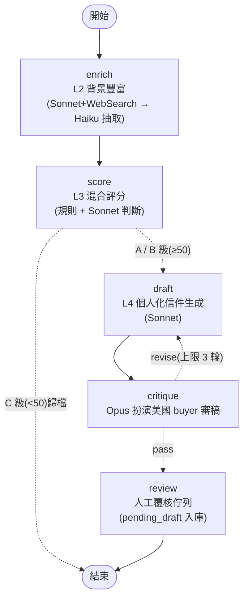

# Ankomn Buyer Intelligence System

支援 **The Inspired Home Show 2027(芝加哥,3/9–3/11)** 參展的全週期 B2B 買家開發系統:
**展前找買家 → 展中管理接觸 → 展後自動跟進**。

本 repo 是 [`plan/buyer_intelligence_architecture.html`](../plan/buyer_intelligence_architecture.html) 的實作;
商業脈絡見 [`plan/ankomn_strategy_report.html`](../plan/ankomn_strategy_report.html)。

## 系統架構(五層 Pipeline)

| 層 | 模組 | 功能 | 模型 |
|---|---|---|---|
| L1 資料擷取 | `adapters/` | Apollo / Google Places / IHA 名錄 / CSV 匯入,統一產出 `RawLead` | — |
| L2 清洗豐富 | `enrich.py` | 去重(rapidfuzz 模糊比對 + email domain)、Hunter 驗證、web 搜尋背景補全 | Sonnet 搜尋 + Haiku 抽取 |
| L3 評分分級 | `scoring.py` | 規則基礎分 + LLM 契合度判斷,加權後分 A/B/C;C 級自動歸檔 | Sonnet |
| L4 觸達引擎 | `outreach.py` | 個人化信件生成 → Opus 扮演美國 buyer 批判 → 重寫迴圈(≤3 輪)→ 人工覆核 | Sonnet 寫 + Opus 審 |
| L5 展中作戰 | `field_ops/`、`dashboard.py` | 名片 OCR、即時 company brief、same-day follow-up、pipeline 看板 | Haiku + Sonnet |

流程編排使用 **LangGraph**(`graph.py`):條件邊依評分分流、critique 迴圈退回重寫、
SQLite checkpoint 讓批次中斷後可續跑不重花 API 費用。



> 每筆 lead 以 `thread_id=lead-{id}` 執行本圖;每個節點結束即寫回
> `leads.db`,checkpoint 存於 `checkpoints.db`,中斷後續跑不重花費用。
> T0 Rep 在 score 節點直接標 A 級走信件通道(獨立於零售商評分)。

### 各層職責詳解

#### L1 資料擷取 — 進料口
**負責:把散落各處的潛在買家變成統一格式的原始名單(`RawLead`)。**

- 輸入:Apollo 搜尋條件 / Places 城市查詢 / IHA 名錄 CSV / LinkedIn 匯出 CSV
- 輸出:`RawLead`(公司、聯絡人、職稱、email、地區、通路分層)
- 指令:`buyer-intel ingest --source apollo|places|iha|manual`
- 四個來源各有分工:Apollo 找「人」(決策人+email)、Places 找「店」
  (獨立小商家,B2B 資料庫查不到的)、IHA 名錄是 T0 Rep 線索的核心來源、
  manual 承接一切手動匯出與展中名片
- 沒有它:巧婦難為無米之炊。**目前的專案瓶頸就在這層**(Apollo API 需付費方案)

#### L2 清洗豐富 — 情報引擎(最花時間與額度的一層)
**負責:把「一行公司名」變成「可以拿來寫信的事實」。**

- 輸入:`RawLead` → 輸出:補全後的 `Lead`(門市數、通路類型、是否賣競品、背景摘要)
- 三個動作依序:
  1. **去重**:公司名模糊比對(自動剝除 Inc/LLC 等後綴)+ email 網域合併,
     資訊較完整的一筆勝出——避免同一家被觸達兩次
  2. **email 驗證**(Hunter):無效信箱標記,保護寄件網域信譽
  3. **背景豐富**:Sonnet 帶 WebSearch 上網查這家公司(規模、通路、競品),
     Haiku 把查到的內容抽成結構化欄位
- 沒有它:L3 沒依據亂評分,L4 的「為什麼找上你」只能瞎編——**個人化立刻退化成罐頭信**

#### L3 評分分級 — 資源守門員
**負責:決定誰值得花觸達成本,誰直接歸檔。**

- 輸入:補全後的 `Lead` → 輸出:分數(0–100)、分級(A/B/C)、可解釋的評分依據
- 混合式評分:規則算得準的用規則(規模、地區、職稱,零成本可解釋),
  需要判斷的交給 LLM(通路契合度)——四維加權 40/25/20/15
- 條件分流:**A(≥70)/ B(50–69)進 L4 寫信;C(<50)自動歸檔,一毛不花**
- T0 Rep 例外:不套零售商評分,直接進信件通道
- 沒有它:額度與人工平均撒在爛 lead 上,好 lead 反而沒被優先對待

#### L4 觸達引擎 — 真正的產品出口
**負責:把 L2 的事實變成一封「值得美國 buyer 回覆」的信。**

- 輸入:A/B 級 `Lead` + 背景事實 → 輸出:通過審稿的信件草稿(進人工覆核佇列)
- 內建品管迴圈:Sonnet 寫 → **Opus 扮演「一天收幾十封開發信的美國買家」毒舌審稿**
  (超過 150 字?像罐頭?理由瞎編?→ 退回重寫,上限 3 輪)
- 信件鐵則:一句話價值主張、為何找上「這一家」的具體理由(只准用 L2 查到的
  事實)、攤位資訊 + Calendly 連結
- **絕不自動寄送**:過稿只是進佇列,`buyer-intel review` 人工核准後輸出
  `outbox/`,由人寄出
- 沒有它:前面三層的投資全部到不了買家眼前

#### L5 展中/展後作戰 — 收割紀律
**負責:展會三天的現場執行力,以及之後的 pipeline 追蹤。**

- **展中**(`buyer-intel serve`,手機開網頁):拍名片 → OCR 入庫 → 自動比對
  「預約客戶還是新接觸」→ 秒回 company brief(什麼通路、該談 wholesale 還是
  rep、FOB/DDP 建議、客製開場白)→ 談完當場記會談重點
- **每晚**(`buyer-intel followup`):依當日會談紀錄批次生成 same-day follow-up
  草稿——支撐「24 小時跟進率 100%」這條 KPI
- **展後**(`buyer-intel dashboard`):漏斗看板 + 逾期未跟進警示,
  追蹤每筆 lead 從接觸到 PO 的階段
- 沒有它:名片變成回國後的一疊廢紙,展會投資的轉化率腰斬

#### 一句話定位

> **L2 是心臟(生產事實),L4 是出口(事實變會議),L3 省錢,L5 收割;
> 但專案生死在系統外的兩件事——L1 的名單量,和寄信網域的到達率。**

### 模型分工(已更新為現行模型 ID)

| 任務 | 模型 ID | 理由 |
|---|---|---|
| 清洗、抽取、名片 OCR 結構化 | `claude-haiku-4-5` | 高頻低難度、成本敏感 |
| 背景豐富、契合度判斷、信件/brief 生成 | `claude-sonnet-5` | 需推理與 web search 綜整,性價比最佳 |
| 信件批判審稿(扮演美國 buyer) | `claude-opus-4-8` | 低頻高價值;一封爛信毀掉一個 A 級 lead |

### 兩條鐵律

1. **Human-in-the-loop**:系統只產草稿,**絕不直接寄信**。核准後的信件輸出到
   `outbox/`,由人工用郵件軟體寄出 —— B2B 信任是資產,不容 AI 幻覺揮霍。
2. **Rep Group(T0)走獨立通道**:不套零售商評分模型,直接進觸達並以
   代理合作(而非批發採購)角度撰寫信件。

## 安裝

```bash
cd buyer-intelligence
python3.11 -m venv .venv && source .venv/bin/activate
pip install -e ".[dev]"

cp .env.example .env   # 依需求填入金鑰(見下)
```

**LLM 後端二選一**(`LLM_BACKEND` 環境變數,見 `llm.py`):

| 後端 | 計費 | 需求 | 取捨 |
|---|---|---|---|
| `claude_code`(預設) | **Claude 訂閱額度** | 已安裝並登入 Claude Code(`claude` 指令) | 免 API key 免儲值;受訂閱用量上限、單筆較慢、結構化輸出以 JSON 解析實作 |
| `api` | API 額度(platform.claude.com 儲值) | `ant auth login` 或 `.env` 填 `ANTHROPIC_API_KEY` | 原生結構化輸出 / web_search / vision,品質與速度最佳 |

訂閱方案沒有 Opus 時,設 `CLI_MODEL_TOP=sonnet` 把審稿模型降級。
Apollo / Hunter / Google Maps 未設定時,對應 adapter 會明確報錯,
其餘功能照常運作(email 驗證會標為未驗證)。

**三個外部工具的申請步驟、方案額度與疑難排解,見 [docs/](docs/) 資料夾**:
[Apollo](docs/apollo.md)、[Hunter](docs/hunter.md)、[Google Maps](docs/google-maps.md)。

## 使用流程

```bash
# 0. 建庫
buyer-intel init

# 1. L1 擷取名單(四選一或混用)
buyer-intel ingest --source manual --file examples/seed_leads.csv          # CSV / LinkedIn 匯出
buyer-intel ingest --source apollo --query "specialty coffee retailer"     # Apollo 決策人搜尋
buyer-intel ingest --source places --query "coffee roaster in Austin, TX"  # 掃城市店家
buyer-intel ingest --source iha --file iha_exhibitors.csv --tier T0_rep    # IHA 名錄(Rep 線索)

# 2. L2–L4 全流程:豐富 → 評分 → 信件草稿 → 覆核佇列
buyer-intel pipeline --limit 20        # --limit 控制單次 API 花費

# 3. 人工覆核:逐筆看草稿,核准後輸出 outbox/ 由人工寄送
buyer-intel review

# 4. 看板:漏斗視圖 + 逾期未跟進警示
buyer-intel dashboard && open dashboard.html
```

### 展中模式(2027/3/9–11)

```bash
buyer-intel serve            # 手機連同一 Wi-Fi,開 http://<電腦IP>:8000
```

白天:拍名片 → OCR 入庫 → 自動比對「預約客戶 or 新接觸」→ 秒回 company brief
(通路類型、該談 wholesale 還是 rep、FOB/DDP 建議、客製開場白)→ 談完當場記會談重點。

每晚:

```bash
buyer-intel followup         # 依當日會談紀錄生成 same-day follow-up 草稿
buyer-intel review           # 人工掃過後寄出 —— 24 小時內跟進率 100% 是 KPI
```

## 評分模型(L3)

| 維度 | 權重 | 邏輯 |
|---|---|---|
| 通路契合度 | 40% | 咖啡器材通路 > 廚房專賣 > 一般零售;已賣競品(Fellow Atmos 等)加分。LLM 判斷 |
| 規模適配度 | 25% | 甜蜜點 5–100 家門市;**過大反而扣分**。規則計算 |
| 地區優先序 | 20% | PNW、TX(P1)> CA、NY(P2)> 中西部(P3)。規則計算 |
| 決策權 | 15% | Owner / Buyer / Category Manager 高分。規則 + LLM 各半 |

總分 ≥70 → **A**(進觸達,信件人工逐封覆核);50–69 → **B**(批次處理);
<50 → **C**(歸檔不觸達)。每筆都有 `score_rationale` 可解釋欄位供人工抽查。

權重與門檻都在 [`config.py`](src/buyer_intel/config.py) —— 展後應以實際回覆率回頭校準。

## 目錄結構

```
buyer-intelligence/
├── src/buyer_intel/
│   ├── config.py            # 模型分工、評分權重、路徑(單一事實來源)
│   ├── models.py            # Pydantic:Lead / RawLead / Interaction 等
│   ├── db.py                # SQLite 單檔存取(data/leads.db)
│   ├── llm.py               # Anthropic client 共用工具(含 pause_turn 處理)
│   ├── adapters/            # L1:apollo / places / iha / manual
│   ├── enrich.py            # L2:去重、email 驗證、web 搜尋豐富
│   ├── scoring.py           # L3:混合式評分與分級
│   ├── outreach.py          # L4:draft → critique → rewrite + follow-up
│   ├── graph.py             # LangGraph 編排 + SQLite checkpoint
│   ├── field_ops/           # L5:ocr.py / brief.py / app.py(FastAPI)
│   ├── dashboard.py         # L5:pipeline 看板 HTML
│   └── cli.py               # buyer-intel 指令入口
├── docs/                    # 外部工具指南(Apollo / Hunter / Google Maps)
├── tests/                   # 規則評分與去重的單元測試(不需 API 金鑰)
├── examples/seed_leads.csv  # 種子名單範例(T1 咖啡器材電商)
├── PROGRESS.md              # 專案日誌(新條目往上加)
└── data/                    # leads.db / checkpoints.db(git 忽略)
```

## 測試

```bash
pytest        # 純規則邏輯,不呼叫 API、不需金鑰
```

## 營運成本

對應架構報告第 07 節:`claude_code` 後端下 LLM 呼叫**走訂閱額度,不另計費**
(但受訂閱用量上限限制);`api` 後端約 $30–80/月(名單開發高峰期偏上緣)。
加上 Apollo / Hunter / Calendly 合計約 **$0–240/月**。`pipeline --limit` 可控制單次批量。

## 開發里程碑對照

| 里程碑 | 時間 | 本 repo 對應 |
|---|---|---|
| M1 資料骨幹 | 2026-08 | `models.py`、`db.py`、apollo/places adapter ✅ |
| M2 評分分級 | 2026-09 | `enrich.py`、`scoring.py`、iha adapter ✅ |
| M3 觸達引擎 | 2026-11 | `outreach.py`、`graph.py`、`review` 指令 ✅ |
| M4 展中模組 | 2027-01 | `field_ops/`(OCR、brief、手機 UI)✅ |
| M5 Pipeline 看板 | 2027-02 | `dashboard.py`、`followup` 指令 ✅ |

> 本 repo 為 v0.1 骨架:五層全部可執行,但 Apollo / IHA 名錄的欄位映射需依
> 實際帳號與檔案格式微調(見各 adapter 註解)。

## 待辦清單

### 短期:驗證期(現在 → 2026-08,對應 M1)

- [ ] `buyer-intel review` 覆核 Prima Coffee 的信件草稿(已在佇列)→ 輸出 `outbox/`
- [ ] `buyer-intel pipeline` 跑完剩餘 3 筆種子名單(Seattle Coffee Gear、
      Clive Coffee 在 P1 地區 PNW,預期 A 級,可對照驗證評分模型)
- [x] 申請 Apollo 帳號 → 已填 `APOLLO_API_KEY`(注意:**People Search API 需付費方案**,
      免費方案改走網頁搜尋 → 匯出 CSV → `ingest --source manual`)
- [ ] 申請 Hunter 免費帳號 → 填 `HUNTER_API_KEY`(email 驗證,退信率是網域信譽命脈)
- [ ] 申請 Google Maps 金鑰 → 填 `GOOGLE_MAPS_API_KEY`(掃 P1/P2 城市獨立店家)
- [ ] 建 Calendly 活動(「TIHS 攤位會議 30 分鐘」)→ 填 `CALENDLY_URL`

### 中期:名單開發期(2026-09 → 12,對應 M2–M3)

- [ ] **寄信基礎設施(L4 成敗的最大實務風險)**:購買專用寄信網域(勿用主網域)、
      設定 SPF/DKIM/DMARC、網域暖機 4–6 週後才開始正式 outreach
- [ ] **CAN-SPAM 合規**:信尾加公司實體地址與退訂機制
- [ ] 開信/回覆追蹤:量大時評估 Instantly / Smartlead 等寄送服務 API
- [ ] Apollo 升級付費方案(免費 tier 對 email export 有限制)
- [ ] IHA 名錄取得後接入 `iha` adapter,建立 T0 Rep Group 名單
- [ ] **名單量反推**:冷信會議轉化率約 2–5%,展前要敲定 15–20 場會議
      → A 級名單需 400–800 筆,以此訂每月名單開發目標

### 展前/展後(2027-01 →,對應 M4–M5)

- [ ] 展中模組實機演練:拿台灣名片測 `buyer-intel serve` 的 OCR 與 brief
- [ ] 評分權重校準:用實際回覆率/會議轉化率回頭調 `config.SCORE_WEIGHTS`
- [ ] 展後把 PO 轉化數據回填,驗證戰略報告 KPI(首批訂單 3–5 家)

### 戰略層(系統外,建議補進戰略報告)

- [ ] 單位經濟:批發價、毛利結構、MOQ、ROI 門檻
- [ ] MAP(最低廣告價格)政策:預防 T1 電商 × T2 零售 × 自有 DTC 的通路衝突
- [ ] gia 獎項報名死線確認(通常在展前數月截止)
